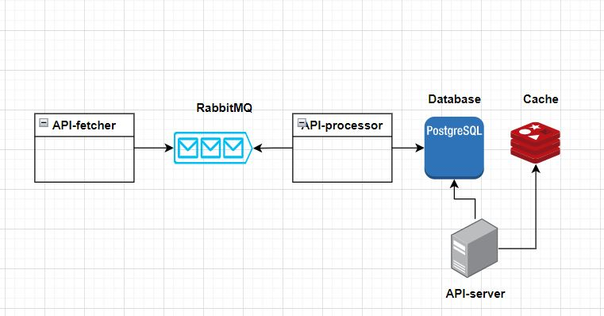

# consume-reddit

## What's all about?

Quick project to experiment and learn some new technologies in practice: GitHub actions, RabbitMQ, Redis and Reddit API. 

This project has been written in Go.

API-fetcher fetches the posts from either hot or new category of some subreddit and store the raw messages in RabbitMQ queue. API-processor pulls the messages, does processing on them and stores them in our format inside the PostgreSQL database. API-server then serves this data using the PostgreSQL, in addition on each GET request it temporarily stores the posts inside the Redis cache.

## Project structure

Each folder contains one component of the system, inside each folder there are folders with kubernetes deployment and tutorial examples used before the component was built. In addition there's also Dockerfiles for dockerizing the components.

### api-server

Fetches the data from database or cache if it exists, in each fetch it stores the data in cache for 24 hours.

Endpoints:
/api/healthchecker - GET request to get the health of the server
/api/post?category=CATEGORY&fromDate=FROM_DATE&toDate=TO_DATE - GET request to fetch the list of posts. Category is either 'Hot' or 'New'. Dates are in format of YYYY-MM-DD.

### reddit-api-fetcher

Fetches the posts from chosen subreddit using Reddit API either from hot or new category. Posts are then stored, in raw json format, to the coresponding queue inside the RabbitMQ. Application is meant to be run as once, sort of as cloud function.

Run this only after the reddit-api-processor is up (messages won't be saved), because this component doesn't create the queue inside the RabbitMQ.

Additional params such as subreddit URL, Reddit account credentials, RabbitMQ broker's uri, topic name and etc. are needed to set up through env vars, see docker-compose.yml

### reddit-api-processor

Fetches the posts from RabbitMQ, process them from raw JSON-s to the appropriate format (presented as structure Post or table Posts inside the database) and stores it in database PostgreSQL. Once the application is up, it auto-creates the queue inside the RabbitMQ for coresponding topic name, it also does the auto-migration as well with GORM. TODO

Unlike reddit-api-fetcher, this application continuesly runs and its not meant as a "cloud function" rather as an never ending working process.

Additional params such as RabbitMQ broker's URI, topic name and etc,  are needed to set up through env vars, see docker-compose.yml.

### postgresql

Custom Dockerfile containing specific version of postgre, and simple SQL script to create the initial database where we are gonna store our Posts.

Additional params such as username and password are needed to set up through env vars, see docker-compose.yml.

### redis

Custom Dockerfile containing specific version of redis, and simple config script to create the user to connect to the redis.

## Local development

For local development docker compose was used. See more details about env vars needed for each component in docker-compose.yml file.

Since some components depend on others, order of deploying was implemented using healtchecks and dependency checks.

## CI/CD

CI/CD has been implemented using GitHub actions and Docker Hub. Reusable workflows have been used for detecting changes inside the folders and building/pushing/tagging images to Docker Hub.

Depending if the folder of each component had any changes, the CI/CD will trigger on push to main and update the image.

## Kubernetes

Each folder inside the folder kubernetes contains the necessary files for deployment

## TODO

Add closing to connection to broker on fetcher

